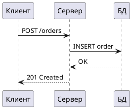

# Docs as Code для системного аналитика: пошаговая инструкция

**Что получится в итоге:** репозиторий на GitHub, в котором документация пишется в
Markdown, автоматически собирается в сайт (MkDocs) и публикуется на GitHub Pages при
каждом мердже в `main`, а каждый Pull Request перед мержем сам проверяется на
орфографию, битые ссылки и синтаксис YAML.

**Что понадобится:** аккаунт на GitHub, установленный Python 3, git и VS Code (подойдёт
любой редактор, но скриншоты и хоткеи в гайде — под VS Code).

---

## 0. Виртуальное окружение

Пакеты ставим не в системный Python, а в изолированное окружение конкретно этого
проекта — иначе рано или поздно словите `command not found: mkdocs` или
`No module named mkdocs`, когда венв другого проекта окажется активирован по ошибке.

```bash
cd documentation                  # папка проекта
python3 -m venv .venv             # создать venv именно здесь
source .venv/bin/activate         # активировать (в начале строки терминала появится (.venv))
which python3                     # должен указывать внутрь documentation/.venv/bin/python3
```

Активировать `.venv` нужно в каждой новой вкладке терминала, где будете запускать
`mkdocs`, `pip` и т.п.

---

## 1. Структура репозитория и первая страница

```bash
mkdir -p docs/backend docs/frontend docs/db
touch docs/backend/create-order.md
```

Открыть `docs/backend/create-order.md` и написать по шаблону: заголовок метода, таблица
атрибутов запроса, пример запроса/ответа. Превью в VS Code — `Cmd+Shift+V` (Mac) /
`Ctrl+Shift+V` (Windows/Linux).

---

## 2. Установка и запуск MkDocs

```bash
pip install mkdocs mkdocs-material
mkdocs new .          # создаёт mkdocs.yml, если его ещё нет
mkdocs serve           # локальный сервер, по умолчанию http://127.0.0.1:8000
```

Откройте адрес в браузере — увидите собранный сайт. Правки в `.md`-файлах подхватываются
сами (hot reload), сервер перезапускать не нужно.

**Важное исключение:** hot reload работает только для текста. После установки **любого**
нового пакета или плагина сервер обязательно нужно остановить (`Ctrl+C`) и запустить
заново — иначе новый плагин не подхватится, и вы будете гадать, почему ничего не
изменилось.

Базовый `mkdocs.yml` для этого стека:

```yaml
site_name: Документация продукта
site_url: https://<ваш-логин>.github.io/<репозиторий>/
repo_url: https://github.com/<ваш-логин>/<репозиторий>

theme:
  name: material
  language: ru
  features:
    - navigation.tabs
    - navigation.sections
    - navigation.top
    - search.suggest
    - content.code.copy

nav:
  - Главная: index.md
  - Бэк:
      - Создание заказа: backend/create-order.md

plugins:
  - search
```

`nav` — это структура левого меню: слева подпись пункта, справа — путь до `.md`-файла
относительно папки `docs/`. Страницу, которой нет в `nav`, MkDocs всё равно соберёт, но
в меню она не появится.

---

## 3. Диаграмма PlantUML прямо в тексте

```bash
pip install mkdocs_puml
```

В `mkdocs.yml`:

```yaml
plugins:
  - search
  - plantuml:
      puml_url: https://www.plantuml.com/plantuml/
```

В `.md`-файле — блок с языком **`puml`, не `plantuml`** (ключевой момент, иначе плагин
не найдёт диаграмму):

````markdown

````

Перезапустить `mkdocs serve` (новый плагин — см. оговорку в шаге 2), открыть страницу —
диаграмма отрендерится в SVG. Запрос на рендер реально уходит на `plantuml.com`; если
нужно, чтобы текст диаграмм не покидал компанию — замените `puml_url` на адрес локального
Docker-контейнера `plantuml/plantuml-server`. Java для этого стека не нужна вообще.

---

## 4. Диаграмма из отдельного `.puml`-файла

Полезно, когда диаграмма большая или переиспользуется на нескольких страницах.

```bash
pip install mkdocs_puml_file
```

**Порядок плагинов важен** — `puml-file` обязан стоять ПЕРЕД `plantuml`, иначе получите
ошибку `file-not-found` прямо на странице сайта:

```yaml
plugins:
  - search
  - puml-file
  - plantuml:
      puml_url: https://www.plantuml.com/plantuml/
```

Создать файл диаграммы рядом с `.md`-файлом, например `docs/db/erd.puml`, и вставить его
как обычную картинку:

```markdown

```

**Путь указывается относительно самого `.md`-файла, а не от корня проекта.** Если файл
диаграммы лежит в той же папке — путь просто `erd.puml`, без `./docs/db/` впереди.
Неправильный путь даёт ту же ошибку `file-not-found`, что и неправильный порядок
плагинов — если что-то не рендерится, проверяйте оба места.

**Ещё один нюанс:** `puml-file` ищет `` по сырому тексту страницы, не
различая, обёрнута ли эта конструкция в инлайн-код. Если нужно просто **упомянуть**
такой синтаксис в тексте (например, в собственной документации о том, как это работает),
а не вставить реальную картинку — избегайте писать квадратные и круглые скобки подряд с
расширением `.puml`, иначе сборка упадёт на несуществующий файл.

Перезапустить сервер — диаграмма отрендерится.

---

## 5. Swagger / OpenAPI отдельной страницей

```bash
pip install mkdocs-render-swagger-plugin
```

```yaml
plugins:
  - search
  - puml-file
  - plantuml:
      puml_url: https://www.plantuml.com/plantuml/
  - render_swagger
```

Положить файл спецификации рядом с новой страницей, например `docs/backend/swagger.yaml`,
и рядом с ним создать `docs/backend/api-reference.md` (по умолчанию плагин требует, чтобы
`.md` и файл спецификации лежали в одной папке):

```markdown
# API Reference

!!swagger swagger.yaml!!
```

Это не обычная markdown-ссылка ``, а особый синтаксис `!!swagger ИМЯ_ФАЙЛА!!`.
Добавьте страницу в `nav` в `mkdocs.yml`, перезапустите сервер — получите интерактивный
Swagger UI с раскрывающимися методами.

Если нужно держать спеку в общей папке, а не рядом с каждой страницей:

```yaml
plugins:
  - render_swagger:
      allow_arbitrary_locations: true
```

---

## 5.1. Картинка макета на фронтенд-странице (+ управление размером)

Положить файл картинки рядом со страницей, например
`docs/frontend/макет-оформления-заказа.jpeg`, и вставить как обычную markdown-картинку —
путь снова относительно `.md`-файла, та же логика, что и с `.puml` в шаге 4:

```markdown

```

Обычный markdown не умеет задавать размер картинки. Для этого нужно расширение
`attr_list`:

```yaml
markdown_extensions:
  - attr_list
```

После этого к картинке (и вообще к любому элементу разметки) можно приписать HTML-атрибуты
в фигурных скобках сразу после ``:

```markdown
{ width="400" }
```

Можно задать `height`, оба атрибута сразу, или указать `%` вместо пикселей
(`width="50%"`) для резиновой ширины. `attr_list` — это расширение markdown
(`markdown_extensions`), а не плагин MkDocs (`plugins`), но новый парсер тоже требует
перезапуска сервера — хот-релоад не сработает (см. оговорку в шаге 2).

---

## 6. Ветки, коммит, Pull Request

```bash
git checkout -b feature/create-order-doc
# внести изменения в файл
git add .
git commit -m "docs: добавить атрибут discount в создание заказа"
git push origin feature/create-order-doc
```

Открыть Pull Request на GitHub. Во вкладке **Files changed** GitHub рендерит Markdown
нативно прямо в диффе — таблицы и код читаются без сборки сайта. После ревью — смержить.

---

## 7. CI/CD: автосборка и деплой на GitHub Pages

Создать `.github/workflows/deploy.yml`:

```yaml
name: Deploy docs

on:
  push:
    branches: [main]

# По умолчанию у токена github-actions[bot] нет прав на запись в репозиторий.
# Без этого блока последний шаг (gh-deploy) падает с ошибкой "403: Permission denied"
permissions:
  contents: write

jobs:
  deploy:
    runs-on: ubuntu-latest
    steps:
      - uses: actions/checkout@v4

      - uses: actions/setup-python@v5
        with:
          python-version: 3.x

      - run: pip install mkdocs mkdocs-material mkdocs_puml mkdocs_puml_file mkdocs-render-swagger-plugin
      - run: mkdocs gh-deploy --force
```

Java этому стеку не нужна — весь рендеринг идёт через HTTP-сервисы и Python-пакеты.
Не забудьте блок `permissions` — без него получите `403` на последнем шаге.

После пуша в `main` откройте вкладку **Actions** на GitHub, дождитесь зелёной галочки,
затем откройте адрес сайта на GitHub Pages (обычно
`https://<логин>.github.io/<репозиторий>/`) — изменения уже там.

---

## 7.1. Линтер документации в пайплайне

Отдельный workflow, который проверяет PR **до** мержа, поэтому триггер другой —
`pull_request`, а не `push` в `main`. Мы сознательно проверяем только три вещи:
**орфографию, битые ссылки и синтаксис YAML** — проверку структуры markdown
(`markdownlint`) в проект не добавляли: она ругается на форматирование и не ловит
реальных ошибок в тексте.

### Проверка орфографии — `yaspeller`

В отличие от словарных чекеров вроде `cspell`, Яндекс.Спеллер понимает русскую
морфологию, а не просто сверяет слово со списком. Конфиг `.yaspellerrc` в корне
репозитория:

```json
{
  "lang": "ru",
  "format": "markdown",
  "findRepeatWords": true,
  "checkYo": true,
  "ignoreUrls": true,
  "ignoreTags": ["code", "pre", "kbd"],
  "excludeFiles": ["docs/backend/swagger.yaml"],
  "dictionary": [
    "MkDocs", "PlantUML", "Swagger", "OpenAPI", "GitHub", "API", "venv", "puml"
  ]
}
```

`dictionary` обязателен — без него любой технический термин или англицизм считается
опечаткой при каждом запуске. Пополняйте его по ходу дела: словарь исключений — это
нормальный, рабочий способ жить с автоматической проверкой орфографии, а не читерство.

**Отдельно стоит знать:** `yaspeller` иногда считает последнее слово заголовка или
пункта списка «слитным» со следующим блоком (особенность конвертера markdown→текст
внутри самого инструмента) и предлагает вставить пробел там, где ошибки нет — такие
слова тоже просто добавляются в `dictionary`.

### Проверка ссылок — `lychee`

Проверяет, что все ссылки в `.md`-файлах (в том числе внешние) рабочие, а не ведут
в 404 — например, ссылку на файл, который забыли создать.

### Проверка YAML — `yamllint`

Проверяет синтаксис собственных YAML-файлов проекта (`mkdocs.yml`, Swagger-спека). Если
в `mkdocs.yml` есть построчные комментарии на русском — понадобится `.yamllint` в корне
репозитория, отключающий проверку длины строки (иначе линтер будет ругаться на каждый
длинный комментарий):

```yaml
extends: default
rules:
  line-length: disable
```

### Сам workflow

Создать `.github/workflows/lint.yml`:

```yaml
name: Lint docs

on:
  pull_request:
    branches: [main]

jobs:
  lint:
    runs-on: ubuntu-latest
    steps:
      - uses: actions/checkout@v4

      - name: Check links
        uses: lycheeverse/lychee-action@v2
        with:
          args: --no-progress 'docs/**/*.md'

      - name: Check spelling
        run: |
          npm install -g yaspeller
          yaspeller docs/**/*.md

      - name: Lint YAML
        run: |
          pip install yamllint
          yamllint mkdocs.yml docs/backend/swagger.yaml
```

Откройте Pull Request — внизу страницы появится блок проверок (checks): зелёные галочки
или красный крестик напротив `lint`. Если крестик красный — в логе конкретного шага
будет точная строка и файл с проблемой.

---

## Итоговая структура репозитория

```text
documentation/
├── .github/workflows/
│   ├── deploy.yml       # публикация сайта на GitHub Pages при push в main
│   └── lint.yml         # проверка PR: орфография, ссылки, YAML
├── .yaspellerrc          # конфиг проверки орфографии
├── .yamllint              # конфиг проверки YAML
├── mkdocs.yml               # конфиг сайта: тема, меню, плагины
└── docs/
    ├── index.md
    ├── backend/
    │   ├── create-order.md
    │   ├── api-reference.md
    │   └── swagger.yaml
    ├── db/
    │   ├── database.md
    │   └── erd.puml
    └── frontend/
        ├── оформление-заказа.md
        └── макет.jpeg
```

## Шпаргалка команд

```bash
source .venv/bin/activate     # активировать venv перед любой работой с проектом
mkdocs serve                    # локальный предпросмотр, перезапускать после pip install
mkdocs build                     # собрать сайт локально, без деплоя (для отладки)
yamllint mkdocs.yml docs/backend/swagger.yaml   # проверить YAML вручную
npx yaspeller docs/**/*.md                        # проверить орфографию вручную
```
